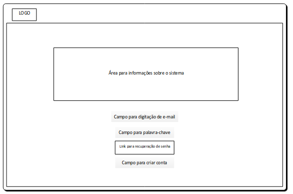
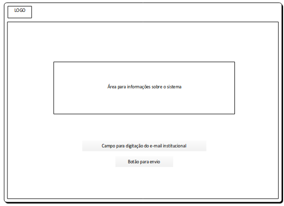
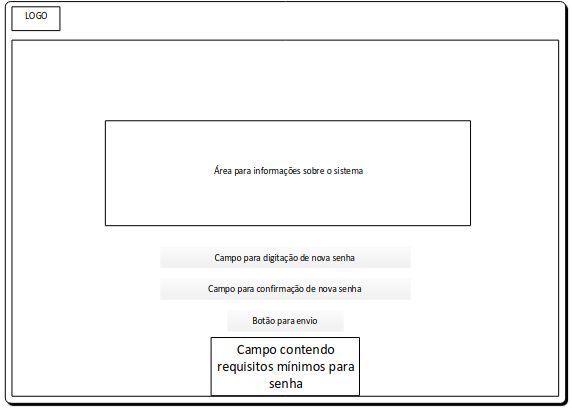
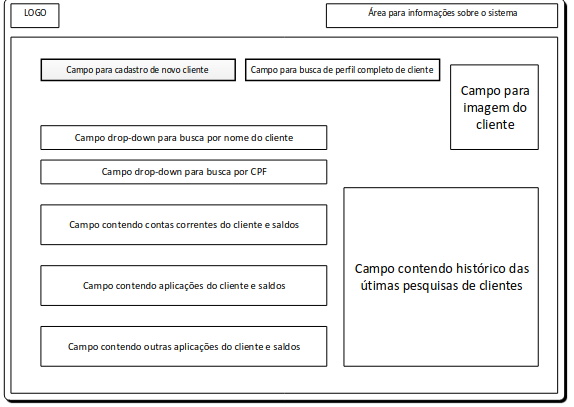
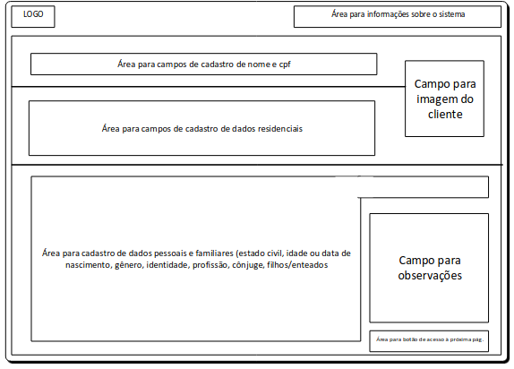
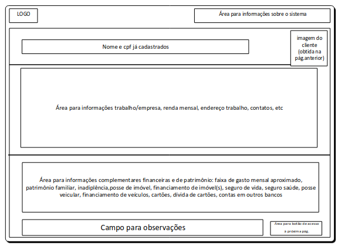
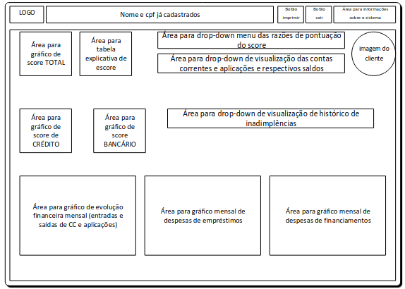

# Projeto de Interface

> Visão geral da interação do usuário pelas telas do sistema e protótipo interativo das telas com as funcionalidades que fazem parte do sistema (wireframes).

## User Flow

Fluxo de usuário (User Flow) é uma técnica que permite ao desenvolvedor mapear todo fluxo de telas do site ou app. Essa técnica funciona para alinhar os caminhos e as possíveis ações que o usuário pode fazer junto com os membros de sua equipe.

---

## Wireframes

# Página Inicial - Login e Registro / Cadastro

Esta tela contém o acesso inicial do Cliente Hub, com possibilidade de acesso no sistema e, a seguir serão requeridos os dados; na hipótese do funcionário não ter feito o primeiro acesso, ele terá a possibilidade de criar uma conta para acesso. A página será ligada com saída para a página de cadastro de novo usuário, a página de recuperação de senha e para a página de busca de perfil de cliente.

A página possui um ligação de retorno da página de cadastro de senha.

Requisito: Permitir que o usuário acesse o sistema com segurança ou crie uma conta. 

Elementos Estruturais: Possibilidade de recuperação de senha por meio de formulário intitulado "esqueci a senha", remetido ao e-mail
previamente cadastrado e confirmado. 

Campos de usuário/e-mail, senha, botões "Esqueci a senha", cadastro via página de cadastro para confirmar.

# Página para recuperação de senha

Esta tela consiste da recuperação de senha do usuário e será acionada a partir do link “Esqueceu a senha”. É provida para recuperação da senha de funcionários já cadastrados. Será conectada à página para “Cadastro de nova senha” 

Requisito: Permitir que o usuário recupere a senha de forma fácil e segura, por meio de link enviado ao e-mail institucional.

Elementos Estruturais: Campo para digitalização do e-mail institucional e botão para confirmação de envio

# Página para Nova senha

Esta tela contém o acesso para recuperação de senha por meio de digitação de nova senha. A origem de acesso a esta página é por meio da “Página para cadastro de usuário (wireframe de Cadastro)” ou por meio de link enviado ao e-mail institucional para recuperação de senha a partir da página “Página para recuperação de senha”. A conexão de saída desta página será a página inicial.

Requisito: Permitir que o usuário cadastre nova senha por meio de digitação e confirmação, com requisitos mínimos de segurança pré-estabelecidos.

Elementos Estruturais: Possibilidade de cadastrar nova senha em elementos estruturais de campos para digitação e confirmação, seguido por envio. Os requisitos mínimos de segurança para nova senha serão estabelecidos e à medida que forem cumpridos os textos dos requisitos listados mudarão de cor para verde.

Campo de digitação de nova senha, campo para confirmação de nova senha, botão para envio e campo fixo com requisitos mínimos de segurança da nova senha.

# Página para busca de perfil de cliente

Esta tela contém o acesso para busca de perfil de cliente. A origem de acesso a esta página é por meio da “Página inicial de login” ou por meio da página 2 de cadastro de cliente. Esta página apresenta duas ligações de saída, para a página 1 de cadastro de cliente e para a página contendo o Dashboard do cliente pesquisado, que é acionada por meio do campo para busca de perfil completo de cliente. Outra saída será por meio dos links do campo contendo histórico das últimas pesquisas de clientes que também permitirá acesso direto aos dashboards dos clientes já pesquisados anteriormente.

Requisito: Permitir que o usuário cadastre novo cliente ou tenha possibilidade de busca de cliente já cadastrado. Deve apresentar o histórico das últimas buscas, além de uma foto do cliente pesquisado para facilitar interação e aumentar segurança.

Elementos Estruturais: Cabeçalho, localizado no topo, contendo o logotipo e as informações sobre o sistema.
Menus de Navegação: Os links de navegação para outras áreas do site encontram-se distribuídos por toda a área central de conteúdo.
Área de Conteúdo Principal: contém: acessos de cadastro e busca de cliente com os campos pertinentes, assim como um campo contendo o histórico de outras buscas para acesso rápido, além de uma foto do cliente para segurança de identificação;
Marcadores: imagem do cliente e área com link a últimas pesquisas de cliente.

Campos do Formulário: Campos de busca de perfil completo do cliente já cessado e cadastro de novo cliente. Campo de busca por nome ou cpf com resultados linkados às contas e aplicaçõe do cliente.

# Página 1 para cadastro de novo cliente

Esta tela contém a primeira página para o cadastro do cliente. O acesso a esta página é único e por meio da “Página para busca de perfil do cliente”. Esta página apresenta uma única ligação de saída para a página dois de cadastro do cliente.

Requisito: Permitir que o usuário cadastre novo cliente com as informações básicas pessoais, incluindo nome, cpf, dados residenciais, além de dados familiares e profissionais.

Elementos Estruturais: Cabeçalho, localizado no topo, contendo o logotipo e as informações sobre o sistema.
Menus de Navegação: Os links de navegação para a página 2 de cadastro encontra-se no canto inferior direito.
Área de Conteúdo Principal: contém áreas de campos a serem preenchidos com acesso de gravação no banco de dados. Há um campo para captura da imagem do cliente; Esta página deverá ter acesso (input) de câmara para digitalização de imagens.
Marcadores: Área para observações.

Campos do Formulário: Campos de busca de entrada de dados, campo para captura de imagem, campo para observações.

# Página 2 para cadastro de novo cliente

Esta tela contém a segunda página para o cadastro do cliente. O acesso a esta página é único e por meio da “Página1 para cadastro de novo cliente”. Esta página apresenta uma única ligação de saída para a “Página de busca do perfil do cliente”. 

Requisito: Permitir que o usuário cadastre dados adicionais de renda e de vínculo empregatício do novo cliente.

Elementos Estruturais: Cabeçalho, localizado no topo, contendo o logotipo e as informações sobre o sistema.
Menus de Navegação: O botão de navegação para a “Página de busca do perfil do cliente” encontra-se no canto inferior direito.

Área de Conteúdo Principal: contém áreas de campos a serem preenchidos com acesso de gravação no banco de dados. A área para informações do trabalho empresa deverá conter menus drop-down com tipo de vínculo empregatício e faixas de renda familiar, assim como o auto preenchimento de alguns campos de endereço a partir do preenchimento do CEP. A área de informações complementares deverá conter
os campos drop-down com informações complementares financeiras e de patrimônio: faixa de gasto mensal aproximado, patrimônio familiar, inadiplência,posse de imóvel, financiamento de imóvel(s), seguro de vida, seguro saúde, posse veicular, financiamento de veículos, cartões, dívida de cartões, contas em outros bancos. Campo para observações.

Campos do Formulário: Campos de entrada de dados em duas áreas, campo para observações e botão para acesso à “página de Busca de Perfil de Cliente”. Os campos de nome, CPF e imagem do cliente serão carregados automaticamente a partir do preenchimento da página 1 do cadastro.

# Página com perfil completo do cliente / Dashboard

Esta tela contém a página com perfil completo do cliente (Dashboard)/Financeiro
O acesso a esta página é único e por meio da “Página de busca do perfil do cliente”. Há ligação de saída para envio de dados para registro histórico das últimas buscas, além da saída da tela para a página inicial e possibilidade de imprimir a busca.

Requisito: Permitir que o usuário acesse de forma rápida e segura os dados financeiros do cliente e que tenha fácil visualização e interpretação.

Elementos Estruturais: Cabeçalho, localizado no topo, contendo o logotipo e as informações sobre o sistema, além do nome e cpf já buscados e
acesso para imprimir e sair do sistema.
Menus de Navegação: O botão de impressão e de saída do sistema.
Área de Conteúdo Principal: contém áreas de campos a serem buscados automaticamente no banco de dados a partir de parâmetros previamente preenchidos e de movimentação financeira do cliente. Contém áreas para gráficos de score e de evolução financeira, além de áreas para botão de drop-down contendo informações relativas ao score.

Campos do Formulário: Campos de visualização de gráficos e de scores. Botão para impressão de relatório e de saída do sistema.